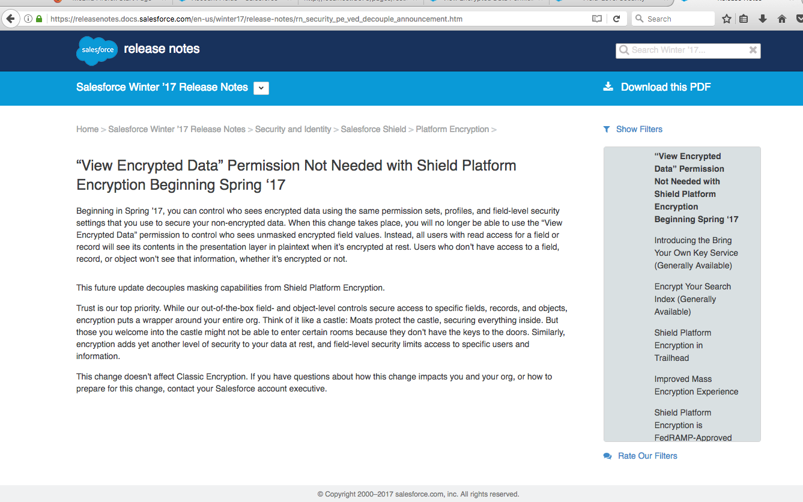
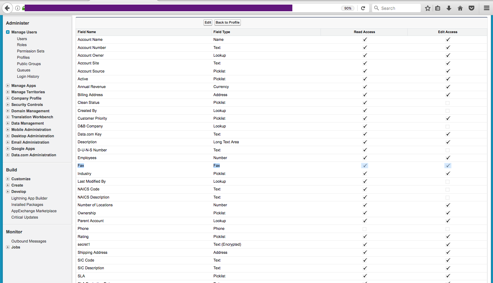

# FAQ - Shield

 1.How do I know a Field in an Object is encrypted at rest?
 --------------------------------------------------------

Metadata API - ***describe*** - provides **encrypted** flag for this encrypted field as **true** as shown below:

#### Account object encrypted fields:

#### Describe on Account Object showing encrypted fields:

#### Describe on Account Object:

2.Knowledge Article: 000247422 says: View Encrypted Data Permission Not Needed with Shield Platform Encryption Beginning Spring ‘17
---------------------------------------------------------------------------------------------------------------------------------
Can you explain this with an example?
-------------------------------------

[Reference to this Knowledge Article](https://help.salesforce.com/articleView?id=000247422&type=1)

[Reference: View Encrypted Data” Permission Not Needed with Shield Platform Encryption Beginning Spring ‘17](https://releasenotes.docs.salesforce.com/en-us/winter17/release-notes/rn_security_pe_ved_decouple_announcement.htm)

Let us take an example: In our org, we have an user: **joe simple**

Joe can see the **encrypted** field: **Account.Fax** but Joe **can't** see the **encrypted** field **Account.Phone** as per FLS for his profile:

#### Account.Fax:

#### Account.Phone:

If Joe uses REST API for example, to access Joe will be denied access to this field **Account.Fax** as shown below:

But other user, whose FLS allows **read** on these fields: **Account.Fax** and **Account.Phone** can access these two fields:

3.Do I have to backup tenant secrets?
--------------------------------------------------------

YES!!!

Tenant secrets are not like passwords.

Unlike passwords, you can’t reset a tenant secret. Salesforce can’t help with deleted, destroyed, or misplaced tenant secrets. Always back up tenant secrets!

4.Is the encrypted fields data encrypted at rest?
--------------------------------------------------------

YES!

You should use field-level access controls to limit who can access this sensitive data as shown above in question number: 2

5.About guideline for selecting fields for encrypting?
--------------------------------------------------------

Unnecessarily encrypting data can slow down performance and affect users day-to-day activities.  Based on your regulatory requirements define the kinds of customer data that require extra security and apply Shield Platform Encryption only to those areas.

6.Can you provide technical details about Platform Encryption?
----------------------------------------------------------------

 Here is the video answering this question:

### Links for curious minds:

What’s the Difference Between Classic Encryption and Shield Platform Encryption?
https://help.salesforce.com/articleView?err=1&id=security_pe_comparison_table.htm&siteLang=en_US&type=0

How Shield Platform Encryption Works:
https://help.salesforce.com/articleView?id=security_pe_concepts.htm&type=0&language=en_US

Tradeoffs and Limitations of Shield Platform Encryption:
https://help.salesforce.com/articleView?err=1&id=security_pe_considerations.htm&siteLang=en_US&type=0

Encrypt Fields:
https://help.salesforce.com/articleView?err=1&id=security_pe_enable_standard_fields.htm&siteLang=en_US&type=0&language=en_US

Salesforce Shield Platform Encryption Whiteboard:
https://www.youtube.com/watch?v=RMUl0fF7x1E

View Encrypted Data Permission Not Needed with Shield Platform Encryption Beginning Spring ‘17
Knowledge Article Number

https://help.salesforce.com/articleView?id=000247422&type=1

View Encrypted Data” Permission Not Needed with Shield Platform Encryption Beginning Spring ‘17:
https://releasenotes.docs.salesforce.com/en-us/winter17/release-notes/rn_security_pe_ved_decouple_announcement.htm

Platform Encryption Best Practices
https://developer.salesforce.com/docs/atlas.en-us.securityImplGuide.meta/securityImplGuide/security_pe_best_practices.htm

SALESFORCE PLATFORM ENCRYPTION
https://resources.docs.salesforce.com/206/latest/en-us/sfdc/pdf/salesforce_platform_encryption_tipsheet.pdf
